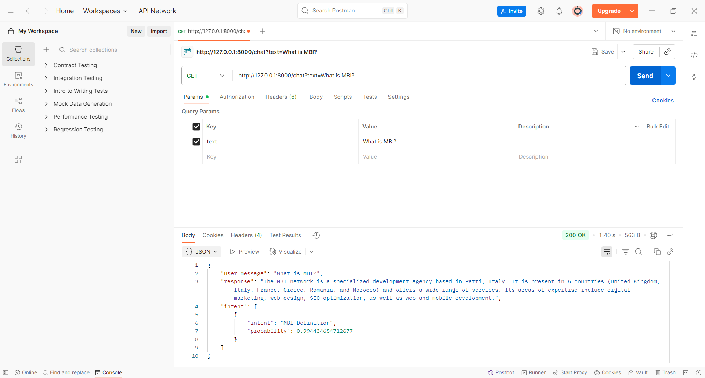

# 🤖 Bilingual Chatbot for Enterprise Queries

## 📌 Project Overview
This project implements a **bilingual chatbot** (English and French) using **Python** and a **neural network** to answer enterprise-related questions. It leverages a JSON file (`mbi_questions_frensh.json` and `mbi_questions_english.json`) for intent-based responses, processes user input with **NLTK**, and deploys a **FastAPI web service** for real-time interaction. The chatbot supports natural language understanding in both languages, with lemmatization and stemming for robust text processing.

---

## 📂 Dataset
- **Input**: JSON files (`mbi_questions_frensh.json`, `mbi_questions_english.json`) containing intents, patterns, and responses.
  - Example structure:
    ```json
    {
      "intents": [
        {
          "tag": "greeting",
          "patterns": ["hello", "bonjour"],
          "responses": ["Hi there!", "Bonjour !"]
        }
      ]
    }
    ```
- **Output**: Appropriate responses based on predicted intent.

---

## 🔍 Project Workflow

### **1. Training the Model**
Build and train a neural network to classify intents from user input.

```python
import random
import json
import pickle
import numpy as np
import tensorflow as tf
import nltk
from nltk.stem import WordNetLemmatizer, SnowballStemmer

lemmatizer = WordNetLemmatizer()
fr_stemmer = SnowballStemmer('french')

# Load French intents
with open('mbi_questions_frensh.json', 'r', encoding="utf8") as file:
    intents = json.load(file)

# Process words and classes
words, classes, documents = [], [], []
for intent in intents['intents']:
    for pattern in intent['patterns']:
        wordList = nltk.word_tokenize(pattern.lower())
        words.extend(wordList)
        documents.append((wordList, intent['tag']))
        if intent['tag'] not in classes:
            classes.append(intent['tag'])

words = sorted(set([fr_stemmer.stem(w.lower()) for w in words if w not in ['?', '!', '.', ',']]))
classes = sorted(set(classes))
pickle.dump(words, open('words.pkl', 'wb'))
pickle.dump(classes, open('classes.pkl', 'wb'))

# Create training data
training = []
outputEmpty = [0] * len(classes)
for document in documents:
    bag = [1 if lemmatizer.lemmatize(word.lower()) in [w.lower() for w in document[0]] else 0 for w in words]
    outputRow = list(outputEmpty)
    outputRow[classes.index(document[1])] = 1
    training.append(bag + outputRow)

random.shuffle(training)
training = np.array(training)
trainX, trainY = training[:, :len(words)], training[:, len(words):]

# Build and train model
model = tf.keras.Sequential([
    tf.keras.layers.Dense(128, input_shape=(len(trainX[0]),), activation='relu'),
    tf.keras.layers.Dropout(0.5),
    tf.keras.layers.Dense(64, activation='relu'),
    tf.keras.layers.Dropout(0.5),
    tf.keras.layers.Dense(len(trainY[0]), activation='softmax')
])
model.compile(optimizer=tf.keras.optimizers.SGD(learning_rate=0.01, momentum=0.9, nesterov=True),
              loss='categorical_crossentropy', metrics=['accuracy'])
model.fit(trainX, trainY, epochs=200, batch_size=5, verbose=1)
model.save('chatbot_model_fr.keras')
```

### **2. Testing the Chatbot**
Interactive console-based testing for user queries.

```python
import random
import json
import pickle
import numpy as np
import nltk
from nltk.stem import WordNetLemmatizer
from tensorflow.keras.models import load_model

lemmatizer = WordNetLemmatizer()
intents = json.load(open('mbi_questions_frensh.json', 'r', encoding="utf8"))
words = pickle.load(open('words.pkl', 'rb'))
classes = pickle.load(open('classes.pkl', 'rb'))
model = load_model('chatbot_model_fr.keras', compile=False)

def clean_up_sentence(sentence):
    return [lemmatizer.lemmatize(word) for word in nltk.word_tokenize(sentence.lower())]

def bag_of_words(sentence):
    return np.array([1 if w in clean_up_sentence(sentence) else 0 for w in words])

def predict_class(sentence):
    res = model.predict(np.array([bag_of_words(sentence)]))[0]
    results = [[i, r] for i, r in enumerate(res) if r > 0.25]
    results.sort(key=lambda x: x[1], reverse=True)
    return [{'intent': classes[r[0]], 'probability': str(r[1])} for r in results]

def get_response(intents_list, intents_json):
    tag = intents_list[0]['intent'] if intents_list else None
    for i in intents_json['intents']:
        if i['tag'] == tag:
            return random.choice(i['responses'])
    return "J'ai pas compris la question, merci de la poser autrement."

while True:
    message = input("")
    if message.lower() == "merci, au revoir":
        print("Merci et bonne journée")
        break
    print(get_response(predict_class(message), intents))
```

### **3. FastAPI Web Service**
Deploy the chatbot as a web service for both English and French queries.

```python
from fastapi import FastAPI, HTTPException
from pydantic import BaseModel
import json
import pickle
import numpy as np
import tensorflow as tf
from nltk.stem import WordNetLemmatizer

app = FastAPI(title="Chatbot API", description="Bilingual Chatbot", version="1.0")
lemmatizer = WordNetLemmatizer()
intents = json.load(open("mbi_questions_english.json", "r", encoding="utf-8"))
words = pickle.load(open("words.pkl", "rb"))
classes = pickle.load(open("classes.pkl", "rb"))
model = tf.keras.models.load_model("chatbot_model_eng.keras", compile=False)

class Message(BaseModel):
    text: str

def clean_up_sentence(sentence: str):
    return [lemmatizer.lemmatize(word.lower()) for word in tf.keras.preprocessing.text.text_to_word_sequence(sentence)]

def bag_of_words(sentence: str):
    return np.array([1 if w in clean_up_sentence(sentence) else 0 for w in words])

def predict_class(sentence: str):
    res = model.predict(np.array([bag_of_words(sentence)]), verbose=0)[0]
    results = [{"intent": classes[i], "probability": float(r)} for i, r in enumerate(res) if r > 0.1]
    results.sort(key=lambda x: x["probability"], reverse=True)
    return results

def get_response(intents_list, intents_json):
    if not intents_list:
        return "I don't understand your question, please try again."
    tag = intents_list[0]["intent"]
    for intent in intents_json["intents"]:
        if intent["tag"] == tag:
            return random.choice(intent["responses"])
    return "I don't understand your question, please try again."

@app.get("/chat")
def chat_get(text: str):
    try:
        ints = predict_class(text)
        res = get_response(ints, intents)
        return {"user_message": text, "response": res, "intent": ints}
    except Exception as e:
        raise HTTPException(status_code=500, detail=f"Error processing request: {str(e)}")
```

---

## 📊 Results
- **Console Testing**: Interactive responses in French with high intent accuracy.
- **FastAPI Testing**:

  API tested via Postman, visualized in:

  .
- **Model Performance**: Trained model achieves reliable intent classification for both English and French queries.

---

## 📦 Requirements
```bash
pip install tensorflow nltk fastapi uvicorn pydantic
```

---

## ▶️ How to Run
1. Clone the repository:
   ```bash
   git clone https://github.com/ali27kh/Chatbot_English_French.git
   cd Chatbot_English_French
   ```
2. Create and activate virtual environment:
   ```bash
   python -m venv venv
   .\venv\Scripts\Activate
   ```
3. Install dependencies:
   ```bash
   pip install -r requirements.txt
   ```
4. Download NLTK data:
   ```bash
   python -c "import nltk; nltk.download('punkt'); nltk.download('wordnet')"
   ```
5. Prepare JSON files (`mbi_questions_frensh.json`, `mbi_questions_english.json`).
6. Run components:
   - Train model: `python train_chatbot.py`
   - Test in console: `python test_chatbot.py`
   - Run FastAPI: `uvicorn main:app --reload`
   - Access API at `http://127.0.0.1:8000/chat?text=your_query`

---

## 📌 Key Insights
- **Bilingual Support**: Handles English and French queries using separate JSON files and models.
- **NLTK Processing**: Lemmatization and stemming ensure robust text normalization.
- **Neural Network**: Achieves high accuracy in intent classification with dropout for regularization.
- **FastAPI**: Provides a scalable web service for real-time chatbot deployment.

---

## 📜 License
MIT License
